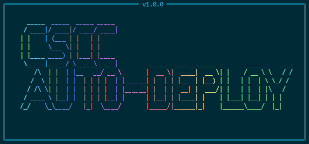

<div align="center">
  
# 🚀 CSCC AUTO-DEPLOY

[](LICENSE)
[](package.json)
[](https://nodejs.org)
[](http://makeapullrequest.com)

<p align="center">
  
</p>

**Fast, Secure, and Modern Web Deployment CLI Tool**  
Streamline your web deployment process with support for FTP, SFTP, and SSH.

[Getting Started](#getting-started) •
[Features](#features) •
[Installation](#installation) •
[Usage](#usage) •
[Documentation](#documentation)

</div>

---

## ✨ Features

- 🔥 **Multiple Protocol Support**
  - FTP deployment
  - SFTP/SSH secure deployment
  - Automatic protocol detection

- 📦 **Smart File Management**
  - Intelligent file tracking
  - Change detection
  - Selective deployment
  - Ignore patterns support

- 🛡️ **Security First**
  - Secure credential handling
  - SSH key authentication
  - Environment variable support
  - Encrypted configuration storage

- 🎯 **Developer Experience**
  - Interactive CLI
  - Progress tracking
  - Detailed logging
  - Configuration management
  - Custom ignore patterns

## 🚀 Getting Started

### Prerequisites

- Node.js >= 14.0.0
- npm or yarn
- SSH access (for SFTP/SSH deployment)
- FTP access (for FTP deployment)

### Installation

```bash
# Using npm (globally)
npm install -g csdeploy

# Using yarn (globally)
yarn global add csdeploy
```

## 📖 Usage

### Quick Start

1. Initialize your project:

```bash
csdeploy init
```

2. Configure deployment settings:

```bash
csdeploy config
```

3. Deploy your project:

```bash
csdeploy deploy
```

### Available Commands

```bash
csdeploy init         # Initialize project configuration
csdeploy config      # Manage deployment configurations
csdeploy deploy      # Deploy your web project
csdeploy status      # Show tracking information
csdeploy check-ignore # Check ignore patterns
```

## 🔧 Configuration

### Basic Configuration

Create a `.env` file in your project root:

```env
HOST=your-host.com
USERNAME=your-username
PASSWORD=your-password
REMOTE_PATH=/public_html
```

### Ignore Patterns

Create a `.cscc-ignore` file to specify which files to ignore:

```plaintext
node_modules/
.git/
.env
*.log
```

## 📚 Documentation

### Command Details

#### `csdeploy init`
- Initializes project configuration
- Creates necessary files and folders
- Sets up ignore patterns

#### `csdeploy config`
- Manages deployment configurations
- Supports multiple environments
- Secure credential storage

#### `csdeploy deploy`
- Smart file deployment
- Progress tracking
- Error handling
- Deployment verification

## 🛠️ Development

### Building from Source

```bash
git clone https://github.com/opestro/web-deploy.git
cd web-deploy
npm install
npm link
```

### Running Tests

```bash
npm test
```

## 🤝 Contributing

Contributions are welcome! Please feel free to submit a Pull Request.

1. Fork the repository
2. Create your feature branch (`git checkout -b feature/AmazingFeature`)
3. Commit your changes (`git commit -m 'Add some AmazingFeature'`)
4. Push to the branch (`git push origin feature/AmazingFeature`)
5. Open a Pull Request

## 📝 License

This project is licensed under the MIT License - see the [LICENSE](LICENSE) file for details.

## 👨‍💻 Author

**Mehdi Harzallah**

- GitHub: [@opestro](https://github.com/opestro)
- LinkedIn: [Mehdi Harzallah](https://linkedin.com/in/mehdi-harzallah)

## 🙏 Acknowledgments

- Node.js community
- Commander.js for CLI support
- SSH2 for secure deployment
- All contributors and users

---

<div align="center">

Made with ❤️ by [Mehdi Harzallah](https://github.com/opestro)

</div>

